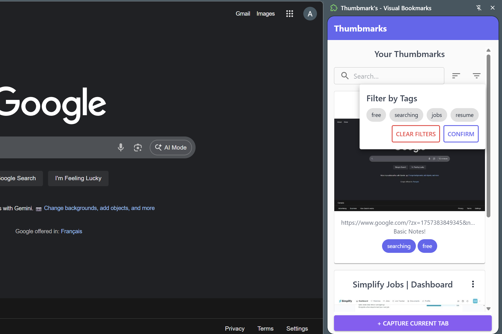

# Thumbmark: Visual Bookmark & Screenshot Organizer

Thumbmark is a browser extension that helps you save and organize web content visually. Unlike traditional bookmarks that are just text links, Thumbmark captures a screenshot and location of the page, providing instant visual context so you can quickly find and remember what you saved.

---

## Features

### One-Click Capture
Capture a screenshot of the **visible portion** of a webpage with a single click of the extension icon. The extension also automatically grabs the page's URL, location and title. This can also be done from the context menu

### Visual Gallery
Your saved bookmarks are displayed in a clean gallery view, represented by their screenshot thumbnails and titles. Clicking on a bookmark opens the original URL in a new tab at the saved location.

### Smart Organization
Add notes and tags to your bookmarks to add essential context and make them more useful than just an image. The flexible tagging system allows for easier categorization than rigid, folder-based systems.

### Quick Search
Easily find a specific bookmark using the built-in search bar, which filters by title, notes, or tags as you type.

### Portable HTML Export(coming soon)
Generate a single HTML file containing all of your saved bookmarks. This self-contained file can be opened in any browser, giving you full control and portability of your curated content.

---

## Problems Solved

* **The "Bookmark Void"**: Traditional text-based bookmarks often lack context, making it hard to remember why you saved a page. Thumbmark's visual bookmarks provide instant recall.
* **Information Overload**: It can be challenging to organize information with standard folder systems, leading to messy lists. Thumbmark's visual representation and flexible tagging make organization intuitive.
* **Inefficient Retrieval**: Scrolling through hundreds or thousands of text links can be slow. Visual cues combined with quick search make finding what you need faster and easier.
* **Lack of Portability**: Bookmarks can be locked into your browser's ecosystem, making them difficult to share or back up. The HTML export feature gives you a shareable and self-contained backup of your data.
* **"Death by a Thousand Tabs"**: Many users keep tabs open as a form of "bookmarking," which can slow down the browser. Thumbmark provides an efficient place to store interesting pages without keeping them as active tabs, improving performance and productivity.
